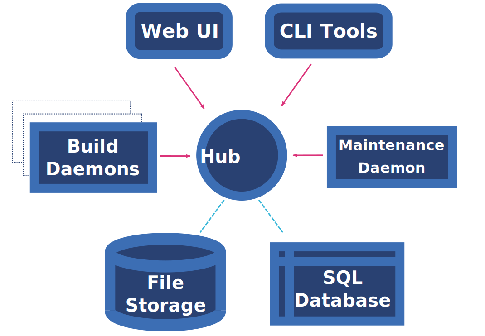

.. Koji documentation master file, created by
   sphinx-quickstart on Tue Nov  3 12:11:18 2015.
   You can adapt this file completely to your liking, but it should at least
   contain the root `toctree` directive.

================================
Welcome to Koji's documentation!
================================

Koji
====

Koji is the software that builds `RPM packages for the Fedora project`_. It
uses `Mock`_ to create chroot environments to perform builds. To download the
source code, report bugs, join the mailing list etc., see the `Koji project
website`_.

Contents
========

.. toctree::
    :maxdepth: 2

    HOWTO
    access_controls
    permissions
    defining_hub_policies
    external_repo_server_bootstrap
    image_build
    winbuild
    exporting_repositories
    tag_inheritance
    misc
    release_notes/release_notes
    migrations/migrations
    CVEs/CVEs
    runs_here
    server_bootstrap
    server_howto
    database_howto
    kojid_conf
    using_the_koji_build_system
    setting_rpm_macros
    profiles
    plugins
    volumes
    writing_koji_code
    content_generators
    content_generator_metadata
    configuring_jenkins
    utils

HowTos
======

Setting up and using Koji on Fedora:

* :doc:`Using the Koji build system <using_the_koji_build_system>`
* :doc:`Run Your Own Koji Build Server <server_howto>`
* :doc:`Building Images in Koji <image_build>`
* :doc:`Defining hub policies <defining_hub_policies>`

Koji Architecture
=================

Terminology
-----------
In Koji it is sometimes necessary to distinguish between a package in general,
a specific build of a package, and the various rpm files created by a build.
When precision is needed, these terms should be interpreted as follows:

Package
    The name of a source rpm. This refers to the package in general and not
    any particular build or subpackage. For example: kernel, glibc, etc.

Build
    A particular build of a package. This refers to the entire build: all
    arches and subpackages. For example: kernel-2.6.9-34.EL, glibc-2.3.4-2.19.

RPM
    A particular rpm. A specific arch and subpackage of a build. For example:
    kernel-2.6.9-34.EL.x86_64, kernel-devel-2.6.9-34.EL.s390,
    glibc-2.3.4-2.19.i686, glibc-common-2.3.4-2.19.ia64

Koji Components
===============

Koji is comprised of several components:

Koji-Hub
--------
koji-hub is the center of all Koji operations. It is an XML-RPC server running
under mod_wsgi in Apache. koji-hub is passive in that it only receives XML-RPC
calls and relies upon the build daemons and other components to initiate
communication. koji-hub is the only component that has direct access to the
database and is one of the two components that have write access to the file
system.

Kojid
-----
kojid is the build daemon that runs on each of the build machines. Its primary
responsibility is polling for incoming build requests and handling them
accordingly. Essentially kojid asks koji-hub for work. Koji also has support
for tasks other than building. Creating install images is one example. kojid
is responsible for handling these tasks as well. kojid uses mock for building.
It also creates a fresh buildroot for every build. kojid is written in Python
and communicates with koji-hub via XML-RPC.

Koji-Web
--------
koji-web is a set of scripts that run in mod_wsgi and use the Cheetah
templating engine to provide a web interface to Koji. It acts as a client to
koji-hub providing a visual interface to perform a limited amount of
administration. koji-web exposes a lot of information and also provides a means
for certain operations, such as cancelling builds.

Koji-client
-----------
koji-client is a CLI written in Python that provides many hooks into Koji. It
allows the user to query much of the data as well as perform actions such as
adding users and initiating build requests.

Kojira
------
kojira is a daemon that keeps the build root repodata updated. It is
responsible for removing redundant build roots and cleaning up after a build
request is completed.

Package Organization
====================

Tags and Targets
----------------

Koji organizes packages using tags:

* Tags are tracked in the database but not on disk
* Tags support multiple inheritance
* Each tag has its own list of valid packages (inheritable)
* Package ownership can be set per-tag (inheritable)
* Tag inheritance is more configurable
* When you build you specify a target rather than a tag

A build target specifies where a package should be built and how it should be
tagged afterwards. This allows target names to remain fixed as tags change
through releases. You can get a full list of build targets with the following
command:

::

    $ koji list-targets

You can see just a single target with the --name option:

::

    $ koji list-targets --name dist-fc7

    Name                           Buildroot                      Destination
    ---------------------------------------------------------------------------------------------
    dist-fc7                       dist-fc7-build                 dist-fc7

This tells you a build for target dist-fc7 will use a buildroot with packages
from the tag dist-fc7-build and tag the resulting packages as dist-fc7.

You can get a list of tags with the following command:

::

    $ koji list-tags

Package lists
-------------

As mentioned above, each tag has its own list of packages that may be placed in
the tag. To see that list for a tag, use the list-pkgs command:

::

    $ koji list-pkgs --tag dist-fc7

    Package                 Tag                     Extra Arches     Owner
    ----------------------- ----------------------- ---------------- ----------------
    ElectricFence           dist-fc6                                 pmachata
    GConf2                  dist-fc6                                 rstrode
    lucene                  dist-fc6                                 dbhole
    lvm2                    dist-fc6                                 lvm-team
    ImageMagick             dist-fc6                                 nmurray
    m17n-db                 dist-fc6                                 majain
    m17n-lib                dist-fc6                                 majain
    MAKEDEV                 dist-fc6                                 clumens
    [...]

The first column is the name of the package, the second tells you which tag the
package entry has been inherited from, and the third tells you the owner of the
package.

Latest Builds
-------------

To see the latest builds for a tag, use the latest-build command:

::

    $ koji latest-build --all dist-fc7

    Build                                     Tag                   Built by
    ----------------------------------------  --------------------  ----------------
    ConsoleKit-0.1.0-5.fc7                    dist-fc7              davidz
    ElectricFence-2.2.2-20.2.2                dist-fc6              jkeating
    GConf2-2.16.0-6.fc7                       dist-fc7              mclasen
    ImageMagick-6.2.8.0-3.fc6.1               dist-fc6-updates      nmurray
    MAKEDEV-3.23-1.2                          dist-fc6              nalin
    MySQL-python-1.2.1_p2-2                   dist-fc7              katzj
    NetworkManager-0.6.5-0.3.cvs20061025.fc7  dist-fc7              caillon
    ORBit2-2.14.6-1.fc7                       dist-fc7              mclasen

The output gives you not only the latest builds, but which tag they have been
inherited from and who built them (note: for builds imported from beehive the
"built by" field may be misleading).

Documentation
-------------

We've tried to make Koji self-documenting wherever possible. The command line
tool will print a list of valid commands and each command supports --help.
For example:

::

    $ koji help

    Koji commands are:
    build                Build a package from source
    cancel-task          Cancel a task
    help                 List available commands
    latest-build         Print the latest builds for a tag
    [...]

::

    $ koji build --help

    usage: koji build [options]  tag URL
    (Specify the --help global option for a list of other help options)

    options:
    -h, --help            show this help message and exit
    --skip-tag            Do not attempt to tag package
    --scratch             Perform a scratch build
    --nowait              Don't wait on build
    [...]

You can see administrator-only command help with --admin. Most users will
never use these additional commands, but if you're setting up your own Koji
system, you may find them very useful.

::

    $ koji help --admin
    Available commands:
            add-external-repo         Create an external repo and/or add one to a tag
            add-group                 Add a group to a tag
            add-group-pkg             Add a package to a group's package listing
    [...]

Koji Deployments
================

Koji is also known to be used in many places, and we :doc:`track them on this
page <runs_here>`. Feel free to add your entry. There is no additional
obligation to you for doing so. :)

Koji Contributor Guides
=======================

If you're interested in submitting patches, writing documentation, or filing
bugs this section is for you. In time this will be the best place to learn
how to get involved.

* :doc:`Getting Started as a Developer <writing_koji_code>`

Indices and tables
==================

* :ref:`genindex`
* :ref:`modindex`
* :ref:`search`

.. _Mock: https://github.com/rpm-software-management/mock/wiki
.. _RPM packages for the Fedora project: https://koji.fedoraproject.org/koji/
.. _Koji project website: https://pagure.io/koji
